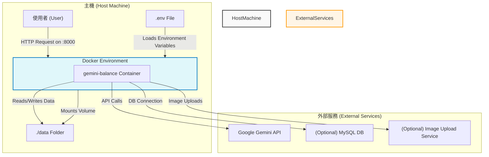

# Gemini Balance 技術架構分析

本文檔基於對 `compose.yml` 和 `.env.example` 檔案的分析，旨在闡述 Gemini Balance 專案的技術架構。

## 總體架構

`Gemini Balance` 專案的核心是一個名為 `gemini-balance` 的單一 Docker 服務。這個服務扮演著一個代理或中介層的角色，主要功能是管理和轉發對 Google Gemini API 的請求，同時提供資料持久化、日誌記錄和高度的可配置性。

## 架構圖

## 關鍵架構元件分析

以下是根據 `compose.yml` 和 `.env.example` 檔案分析出的關鍵架構資訊：

*   **服務 (Services)**:
    *   只定義了一個服務：`gemini-balance`。

*   **Docker 映像檔 (Image)**:
    *   使用 `ghcr.io/snailyp/gemini-balance:latest`，這是一個來自 GitHub Container Registry 的公開映像檔。

*   **對外連接埠 (Ports)**:
    *   將主機的 `8000` 連接埠映射到容器的 `8000` 連接埠 (`8000:8000`)。這意味著使用者可以透過主機的 `http://<host_ip>:8000` 來存取此服務。

*   **服務依賴 (Depends On)**:
    *   `compose.yml` 中沒有定義任何服務間的依賴關係，因為這是個單一服務的應用程式。

*   **網路與儲存卷 (Networks & Volumes)**:
    *   **網路**: 未明確定義，將使用 Docker Compose 建立的預設橋接網路。
    *   **儲存卷**: 將主機的 `./data` 目錄掛載到容器的 `/app/data`。這主要用於資料持久化，很可能是存放 SQLite 資料庫檔案或應用程式產生的其他資料。

*   **環境變數 (Environment Variables from `.env`)**:
    *   此服務的行為高度依賴 `.env` 檔案中的設定。`.env.example` 揭示了大量的配置選項，包括：
        *   **資料庫配置**: 可選擇 `sqlite` (預設) 或 `mysql`。
        *   **API 金鑰管理**: 用於設定 Gemini API 金鑰、授權權杖等。
        *   **模型選擇**: 可配置不同任務（如對話、圖像生成）所使用的具體模型。
        *   **功能開關**: 大量的布林值開關，用於啟用或禁用特定功能（如程式碼執行、日誌記錄、假流式輸出等）。
        *   **外部服務整合**: 包含代理伺服器、圖片上傳服務（SMMS, PicGo, Cloudflare）的設定。