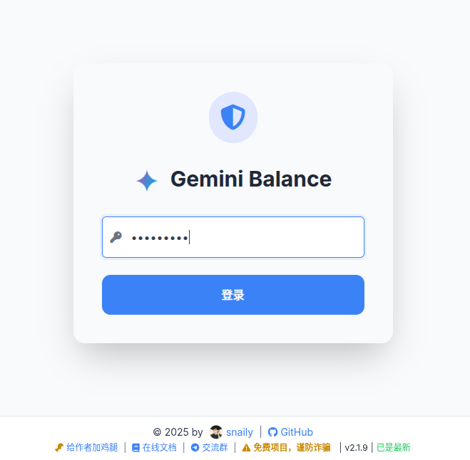

# Gemini Balance 專案

Gemini Balance 是一個用於管理 Google Gemini API 使用配額的工具，提供簡易的 Web 介面來監控和管理 API 使用情況。

## 📋 功能特點

- 即時監控 Gemini API 使用配額
- 簡單易用的管理介面
- 支援多用戶授權管理
- 提供 API 金鑰整合功能

## 🚀 快速開始

### 環境需求

- Docker 20.10.0 或更新版本
- Docker Compose 2.0.0 或更新版本
- 可用的 Google Gemini API 金鑰

### 安裝與啟動

#### 方法一：使用 Docker Compose（推薦）

1. 複製環境變數範本：
   ```bash
   cp .env.example .env
   ```

2. 編輯 `.env` 檔案，設定必要的環境變數：
   ```
   # 管理介面認證金鑰
   AUTH_TOKEN=your_secure_password_here
   
   # 允許的 API 金鑰（多個金鑰用逗號分隔）
   ALLOWED_TOKENS=your_gemini_api_key_here
   ```

3. 啟動服務：
   ```bash
   docker compose up -d
   ```

#### 方法二：直接使用 Docker 指令

```bash
docker run -d \
  -p 8000:8000 \
  --env-file .env \
  -v $PWD/data:/app/data \
  ghcr.io/snailyp/gemini-balance:latest
```

## 🔧 設定說明

### 環境變數

| 變數名稱 | 必填 | 預設值 | 說明 |
|---------|------|--------|------|
| `AUTH_TOKEN` | 是 | 無 | 管理介面的認證密碼 |
| `ALLOWED_TOKENS` | 是 | 無 | 允許的 API 金鑰，多個用逗號分隔 |
| `PORT` | 否 | 8000 | 服務監聽端口 |
| `LOG_LEVEL` | 否 | info | 日誌等級 (debug, info, warning, error) |

### 資料儲存

所有資料會儲存在 `./data` 目錄下，請確保該目錄有適當的寫入權限。

## 🌐 使用說明

### 管理介面

1. 開啟瀏覽器訪問：http://localhost:8000
2. 使用 `.env` 中設定的 `AUTH_TOKEN` 進行登入



### VSCode 整合

請參考 [kilo-code/README.md](kilo-code/README.md) 文件了解如何設定 KILO Code 擴充套件。

## 📊 配額與限制

請參考 Google Gemini API 官方文件了解當前配額限制：
[Google Gemini API 配額限制](https://ai.google.dev/gemini-api/docs/rate-limits?hl=zh-tw#current-rate-limits)

## 🔗 相關連結

- [GitHub 倉庫](https://github.com/snailyp/gemini-balance)
- [Google Gemini API 文件](https://ai.google.dev/gemini-api/docs?hl=zh-tw)
- [Docker Hub](https://hub.docker.com/r/snailyp/gemini-balance)

## 🤝 貢獻

歡迎提交 Pull Request 或回報問題。

## 📄 授權

本專案採用 MIT 授權條款。詳細請參閱 [LICENSE](LICENSE) 檔案。
