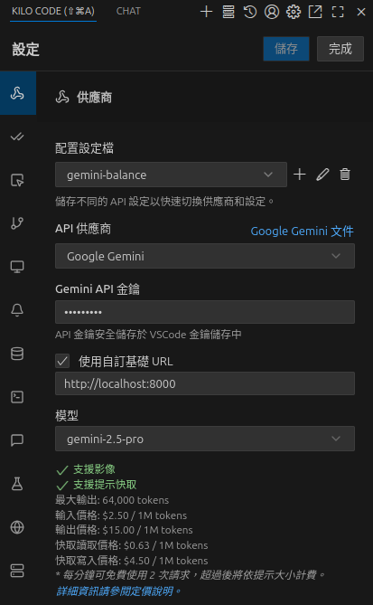

# KILO Code 整合設定

本文檔說明如何將 KILO Code 擴充套件與 Gemini Balance 專案整合。

## VSCode 整合設定

1. 在 VSCode 中安裝 KILO Code 擴充套件
2. 在擴充套件設定中設定以下參數：
   - **端點**：`http://localhost:8000`
   - **認證金鑰**：與 `.env` 檔案中的 `AUTH_TOKEN` 相同

### 管理介面預覽

## 注意事項

- 請確保 Gemini Balance 服務已正確啟動並運行在設定的端口上
- 管理介面的認證金鑰（`AUTH_TOKEN`）需要妥善保管，避免外洩
- 如需變更設定，請更新 `.env` 檔案後重新啟動服務
